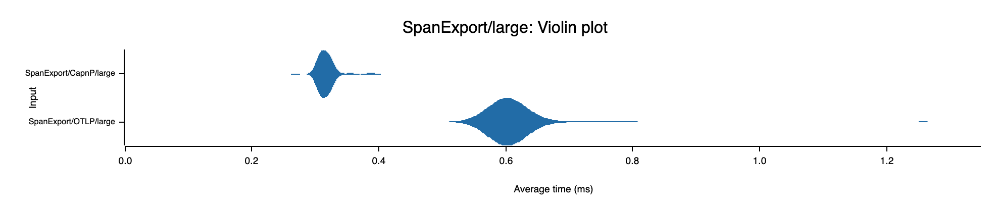

# OpenTelemetry OTLP with Cap'n Proto

This workspace is for developing OpenTelemetry Exporters and Receivers that use
Cap'n Proto in place of ProtoBuf and gRPC for OpenTelemetry. Cap'n Proto should provide
performance gains both in terms of speed and memory usage. Preliminary benchmarks show that
exporting Spans is almost 2x times faster. Even greater gains are expected on the receiver side. 

