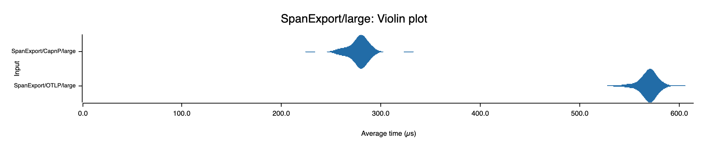

# opentelemetry-otlp-capnp
## OpenTelemetry Exporters and Recievers that use Cap'N Proto
This workspace is for developing OpenTelemetry Exporters and Receivers that use
Cap'n Proto in place of ProtoBuf and gRPC for OpenTelemetry. Cap'n Proto should provide
performance gains both in terms of speed and memory usage. Preliminary benchmarks show that
exporting Spans is almost 2x faster for batches of 1000 spans. The gains are closer to 1.5x faster 
for smaller batches. Even greater gains are expected on the receiver side. The performance gains mean that monitoring your service uses less resources.



- The `opentelemetry-otlp-capnp` crate defines the exporters and receivers needed to use
Cap'N Proto for the over-the-wire protocol for telemetry. It is
the Cap'N Proto equivalent of the `opentelemetry-otlp` crate which uses
`tonic` for `gRPC`.
- The Cap'N Proto schema that follows the OTEL spec is defined in
the `schema` crate. That crate is
the Cap'N Proto equivalent of the `opentelemetry-proto` crate
which has the ProtoBuf schema.
- The `opentelemetry-capnp` crate contains transform logic along with some empty directories 
where the code generated by Cap'n Proto is placed at build time.

This project is in early development.

## Usage
### 1. Install the `capnp` [tool](https://capnproto.org/capnp-tool.html) using [just](https://github.com/casey/just):

```bash
just install-capnp
```

### 2. Update your `Cargo.toml`

```toml
[dependencies]
opentelemetry-otlp-capnp = { git = "https://github.com/fox-daniel/opentelemetry-otlp-capnp.git" }
```

### 3. When you are instrumenting your app using the `opentelemetry-otlp` crate you will have a line like

```rust
use opentelemetry-otlp::SpanExporter;
```
Update that to

```rust
use opentelemetry-otlp-capnp::SpanExporter;
```
Now you will have improved Span export performance thanks to Cap'n Proto!

__WARNING:__ The `SpanReceiver` currently only writes the spans to `stdout`. This is not very helpful! We hope to have functional receivers soon so that you can easily swap Cap'n-Proto-based exporters __and receivers__ into your monitoring workflow. 

## Development
Clone the repo

```bash
git clone https://github.com/fox-daniel/opentelemetry-otlp-capnp.git
```

Install `capnp` using [just](https://github.com/casey/just):

```bash
just install-capnp
```
Then you can build the project with

```bash
cargo build
```

The exporters and receivers 
There are examples in `opentelemetry-otlp-capnp/opentelemetry-otlp-capnp/examples` with instructions in their `README`s.

## Benchmarks
Run the benchmarks from `opentelemetry-otlp-capnp/opentelemetry-otlp-capnp` with

```bash
cargo bench  
```
The resulting report can be found in
```
opentelemetry-otlp-capnp/target/criterion/report/index.html
```
